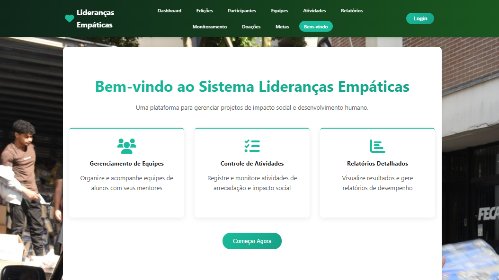

# FECAP - Fundação de Comércio Álvares Penteado

# ESC

## Integrantes: <a href="https://www.linkedin.com/in/eric-de-lucas-silva/">Eric de Lucas Silva</a>, <a href="https://www.linkedin.com/in/stephanie-silva-1b6100340/">Stephanie Macedo da Silva</a>, <a href="https://www.linkedin.com/in/chenn-tube-53b550381/">EnHsiang Chien</a>, <a href="https://www.linkedin.com/in/joel-copa-378304359/?utm_source=share&utm_campaign=share_via&utm_content=profile&utm_medium=ios_app">Joel Ademir Laura.</a>

## Professores Orientadores: <a href="https://www.linkedin.com/in/cristina-machado-corr%C3%AAa-leite-630309160/">Cristina Machado Correa Leite</a>, <a href="https://www.linkedin.com/in/francisco-escobar/">Francisco de Souza Escobar</a>, <a href="https://www.linkedin.com/in/j%C3%A9sus-gomes-83b769108/">Jesus De Lisboa Gomes</a>, <a href="https://www.linkedin.com/in/dolemes/">David De Oliveira Lemes</a>, <a href="https://www.linkedin.com/in/katia-bossi/">Katia Milani Lara Bossi</a>

## Descrição
É importante destacar que um projeto de extensão não precisa ser necessariamente igual a um projeto de pesquisa. Mesmo que haja necessidade de pesquisa prévia para a fundamentação teórica, construção da introdução e para um melhor entendimento sobre a realidade a ser trabalhada, é preciso que um projeto de extensão contemple práticas que promovam mudanças e/ou melhorias identificadas como necessárias. O projeto final deverá ser simples, objetivo, claro e ter de 3 a 5 páginas, dentro do modelo aqui proposto.
 

  
   
  Lideranças Empáticas

Nosso projeto é uma plataforma desenvolvida para apoiar o projetos institucionais da FECAP, com foco na formação de líderes empáticos e comprometidos com o impacto social. O sistema foi criado para facilitar o gerenciamento das campanhas de arrecadação realizadas pelos alunos, permitindo o controle de equipes, projetos e resultados de forma prática e organizada. Seu principal objetivo é digitalizar o acompanhamento das ações do projeto, tornando-as mais eficientes e seguros.

Por meio da plataforma, os usuários podem cadastrar alunos, equipes e campanhas, além de registrar e acompanhar doações de alimentos e valores arrecadados. O sistema também possibilita que mentores acompanhem o desempenho dos grupos e emitam relatórios sobre o progresso das atividades. Dessa forma, promove uma gestão mais justa e integrada das campanhas, incentivando a colaboração, a responsabilidade social e o desenvolvimento de habilidades de liderança entre os participantes.

 

## 🛠 Estrutura de pastas

-Raiz 
<pre>
  
.
── entregas
   ├── documentos
   │   ├── Entrega 1
   │   └── Entrega 2
   ├── imagens
   └── src
       ├── Entrega 1
       └── Entrega 2
</pre>

## 🛠 Instalação

<b>HTML:</b>

Link do projeto: https://stunning-paletas-cbe215.netlify.app/

## 💻 Configuração para Desenvolvimento

Este guia explica como preparar e rodar o projeto Lideranças Empáticas em ambiente local.

🗂️ 1. Caminho do projeto

Abra o terminal dentro da pasta:
<pre>
ESC_Semestre2_PI\muu\muu
</pre>
Ao mesmo tempo ligamos o backend:
<pre>
ESC_Semestre2_PI\muu\Backend
</pre>

📌 Dica: Se estiver usando o VS Code, clique com o botão direito nessa pasta e escolha
“Abrir no Terminal Integrado”.

🧩 2. Verifique se o Node.js e o NPM estão instalados

Execute no terminal:
<pre>
node -v
npm -v
</pre>
✅ Se aparecer algo como:
<pre>
v20.12.0
10.5.0
</pre>

significa que o Node e o NPM estão instalados corretamente.

⚠️ Se aparecer “node não é reconhecido”,
baixe e instale o Node.js:
👉 https://nodejs.org/en

📦 3. Instale as dependências principais

Dentro da pasta do projeto, execute:
<pre>
npm install
</pre>

Esse comando instala todas as dependências listadas no package.json.
Após a instalação, uma pasta chamada node_modules será criada automaticamente.

🔐 4. Instale as dependências adicionais (backend)

Esses pacotes garantem o funcionamento correto da API e da conexão com o banco de dados:
<pre>  
npm install express mysql2 dotenv bcrypt jsonwebtoken uuid crypto
</pre>

📘 Descrição dos pacotes:

* express → framework do servidor Node.js

* mysql2 → conexão com o banco MySQL

* dotenv → leitura das variáveis do arquivo .env

* bcrypt → criptografia de senhas

* jsonwebtoken → autenticação JWT

* uuid → geração de IDs únicos

* crypto → funções criptográficas complementares

⚙️ 5. Instale o Nodemon (modo de desenvolvimento automático)

O Nodemon reinicia o servidor automaticamente sempre que você salva alguma alteração no código:
<pre>
npm install -g nodemon
</pre>
ou, se preferir instalar apenas no projeto:
<pre>
npm install nodemon --save-dev
</pre>

🚀 6. Inicie o servidor

Para rodar o backend em modo de desenvolvimento, execute:
<pre>
npm run dev
</pre>

Se tudo estiver correto, você verá algo parecido com isto no terminal:

Servidor rodando na porta 3001
Acesse: http://localhost:3001/api
Health check: http://localhost:3001/api/health

🧠 7. Teste o servidor

Abra o navegador ou o Postman e acesse:

http://localhost:3001/api/test

Você deve ver uma resposta semelhante a:
<pre>
{
  "message": "API Lideranças Empáticas funcionando!",
  "timestamp": "2025-10-29T23:10:00.000Z",
  "version": "1.0.0",
  "database": "MySQL"
}
</pre>

## 📋 Licença/License
<a href="https://stunning-paletas-cbe215.netlify.app/">ESC-Lideranças Empaticas</a> © 2025 por <a href="https://github.com/Ericdelucas">Eric De Lucas; Stephanie Macedo; EnHsiang Chien; Joel</a> Ademir é licenciado <a href="https://creativecommons.org/licenses/by/4.0/">sob CC BY 4.0</a>

## 🎓 Referências

Aqui estão as referências usadas no projeto.

1. <https://liderancasempaticas.com/>
2. <https://www.linkedin.com/company/projeto-lideran%C3%A7as-emp%C3%A1ticas/>
3. <https://www.instagram.com/liderancasempaticas/>
